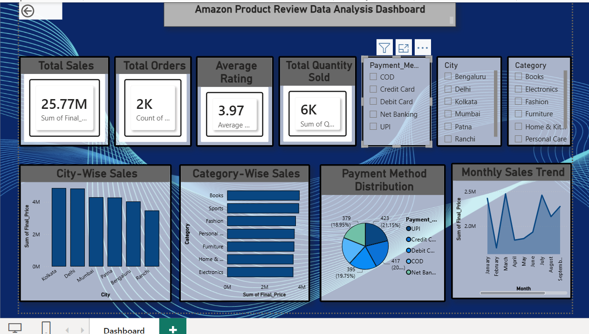

# 🛒 Amazon Product Review Analysis

## 📌 Project Overview
This project analyzes Amazon product review data using **Python (Pandas)** and presents insights through an interactive **Power BI Dashboard**.

The goal of this project is to clean, analyze, and visualize customer review data to identify trends in ratings, pricing, discounts, and product categories.

---

## 📂 Repository Contents

| File | Description |
|------|-------------|
| `Amazon_Product_Review_Dataset.xlsx` | Dataset used for analysis |
| `Analysis.ipynb` | Jupyter Notebook containing data cleaning and analysis |
| `Dashboard.pbix` | Interactive Power BI dashboard |
| `Screenshot.png` | Dashboard preview |
| `README.md` | Project documentation |

---

## 🛠️ Technologies Used

- Python
- Pandas
- NumPy
- Matplotlib
- Seaborn
- Jupyter Notebook
- Microsoft Power BI
- Microsoft Excel

---

## 📊 Project Workflow

1. Import Dataset
2. Data Cleaning
3. Handle Missing Values
4. Remove Duplicates
5. Data Exploration
6. Feature Engineering
7. Exploratory Data Analysis (EDA)
8. Create Visualizations
9. Build Power BI Dashboard
10. Generate Business Insights

---

## 📈 Key Analysis Performed

- Total Products
- Product Categories
- Average Ratings
- Rating Distribution
- Discount Percentage Analysis
- Price Analysis
- Most Reviewed Products
- Top Rated Products
- Category-wise Performance
- Customer Review Analysis

---

## 📊 Dashboard Features

The Power BI dashboard includes:

- KPI Cards
- Rating Analysis
- Product Category Analysis
- Price vs Discount Analysis
- Top Rated Products
- Review Count Analysis
- Interactive Filters (Slicers)

---

## 📷 Dashboard Preview

> Dashboard Screenshot



---

## 🚀 How to Run the Project

### Clone the Repository

```bash
git clone https://github.com/priyaranjanvishwakarma96-ui/Amazon_Product_Review_Analysis.git
```

### Install Required Libraries

```bash
pip install pandas, openpyxl
```

### Open Jupyter Notebook

```bash
jupyter notebook
```

Run:

```
Analysis.ipynb
```

---

## 📌 Project Objectives

- Perform data cleaning
- Analyze customer ratings
- Identify best-performing categories
- Study discount patterns
- Build an interactive dashboard
- Generate business insights

---

## 📷 Dataset Information

- Source: Amazon Product Review Dataset
- Format: Excel (.xlsx)

---

## 📚 Skills Demonstrated

- Data Cleaning
- Data Analysis
- Exploratory Data Analysis (EDA)
- Data Visualization
- Dashboard Development
- Business Intelligence
- Python Programming
- Power BI

---

## 👨‍💻 Author

**Priyaranjan Vishwakarma**
Computer Science Engineering

GitHub: https://github.com/priyaranjanvishwakarma96-ui

---

